# Behaviorial Cloning Project

[](http://www.udacity.com/drive)

Overview
---
This repository contains project files for the [Behavioral Cloning Project](https://github.com/udacity/CarND-Behavioral-Cloning-P3).

This project used deep neural networks and convolutional neural networks to clone driving behavior. The model will output the steering angles to drive an autonomous vehicle.  The neural network architecture is based on [nVidia paper](https://arxiv.org/abs/1604.07316) which uses a CNN to map raw pixels from a single front-facing camera to steering commands.  This architecture has proven to be successful in car self-driving enviroment so it should be proper in this project. 

We use Udacity car simulator to collect view image data of the center, left and right cameras with the steering angle, throttle, and speed at the same time.   Data balance and augmentation are used to increase data quality of training.  After trained, the model can drive the autonomous car full rounds on both the track one and two.


## Project Goals
* Use the simulator to collect data of good driving behavior
* Preprocess and augment on the collected data
* Build a convolution neural network in Keras that predicts steering angles from images
* Train and validate the model with a training and validation set
* Test that the model successfully drives around track one without leaving the road
* Summarize the results with a written report

## File Included
* model.py: containing the script to create and train the model
* drive.py: for driving the car in autonomous mode
* model.h5: containing a trained convolution neural network 
* README.md: summarizing the results
* enviroment.yml and enviroment-gpu.yml: enviroment build script

## Code Excution
### 1. enviroment
The model was trained on Ubuntu 14/GTX 1080 and driving car by the simulator on Mac OSX.  These two platforms have same software version, binary compatible by the conda enviroment.yml and enviroment-gpu.yml scripts.  The environment is created by executing
```sh
$ conda env create -f enviroment.yml 
```
or 

```sh
$ conda env create -f enviroment-gpu.yml 
```

### 2. training the model
Tensorflow and Keras platforms are used to build deep neural networks.  The training data are needed to be download manually or be collected by the car simulator.  The collected driving data are put under ./data/ directory and ./data/driving_log.csv should exist.  The model is started to train by executing
```sh
$ python model.py
```

### 3. drive a autonomous car by the model
The car can be driven autonomously around the track in the car simulator by executing 
```sh
$ python drive.py model.h5
```

## Computer Graphics Model for Camera View

### 1. assumptions for perspective view parameters 
The car simulators record three camera veiws: center, left, and right views, in the training mode.  Only the center view is given in autonomous driving mode.   We can extend our training sets by transforming left and right views to center view based on perspective projection modification.  But we don't have the exact camera positions and projection matrix of them.  We made some assumptions and adopted some tricks to estimate these parameters and projection formula. 

The bridge landscape shown in the following were used because they are parallel straigt lines in the scene.  Th car width is assumed as the average width 1.9 meters.  Comparing to the car width, the bridge width is estimated about 7.6 meters.  The center camera is assumed to position at the center of the car. The left and right cameras are on the side of the car and assumed to be aparted from the center camera from 0.9 meters.    The height of camera is roughly the same as our eyes's height in driving, about 1.5 meter.  


Based on these assumption, the road views are projected onto the camera screen illustrated in the following.   The y-positions of the camera are set to be zero for convenience.  Therefore, the road is on the plane at y = -1.5 meter.    The x-position of the center camera is set to be zero, and the x-poistions of the left camera and right camera are -0.9 meter and 0.9 meter, respectively. 


The center, left and right camera views recorded by the car simulator are shown in the following. The cross of two red lines are the vanishing point of parallel lines.  They are all vanished at the same point, say (160, 60) in all our captured images.  The scene above the blue line is infinity or sky which we are not interested for car driving.  The scene below the blue line is the road and assumed at the same plane, say y = -1.5 meter.  The assumption may introduce some distorion but it works in most cases. 

<table border="1">
<tr>
<td></td>
<td></td>
<td></td>
</tr>
<tr>
<td><center>left view</center></td>
<td><center>center view</center></td>
<td><center>right view</center></td>
</tr>
</table>

### 2. transformation for camera shift

Based on these assumption, we have the x and y coordinates of the object and camera.  We need furthur to estimate the z coordinate (z-depth) for projection.   The tricks of corresponding landmarks are used to estimate them.   These landmarks marked in the following images are easy to tracked in the all three views.  z-depth and the projection matrix are calculated accoring to these corresponing points. 

<table border="1">
<tr>
<td align="bottom"></td>
<td align="bottom"></td>
</tr>
<tr>
<td><center>perspective view</center></td>
<td><center>center view</center></td>
</tr>
</table>

After math reduction and some linear regression, A quite simple transformation formula for the camera shift.

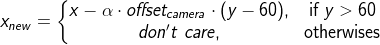

, where x, and y are the x- and y-coordinates in the captured view image, which range from (0, 0) to (300, 160). Parameter &alpha; is found the linear regresssion fitting the above landmarks.  The &alpha; is found as 0.72. 

The following gives the examples to apply these formula to map the left and right camera view to the center camera position. That is, shift the left camera view by 0.9 meter and the right one by -0.9 meter.  These shifting transforms to make these images viewed similarily at the center position.   We can compare them to the real center images, and they are quite matched. 

<table border="1">
<tr>
<td>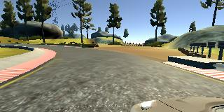</td>
<td></td>
<td>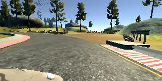</td>
</tr>
<tr>
<td><center>left view</center></td>
<td><center>center view</center></td>
<td><center>right view</center></td>
</tr>
<tr>
<td>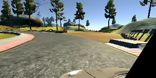</td>
<td></td>
<td>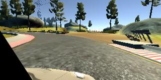</td>
</tr>
<tr>
<td><center>mapped left view to center camera</center></td>
<td><center>original center view</center></td>
<td><center>mapped right view to center camera</center></td>
</tr>
</table>

### 3. transformation for camera view rotation

The image moves left if the camera direction turns right.   The translation of the images are used for data augmentation for a small camera view angle rotation horizontally.
 The corresponding relationship between the image translation and the camera rotation angle are estimated by using the below image. The width 2 meters is got by comparing with car width.  The depth 4m is got by the bridge width substracting the car trunk size.  The relationship that translating 1 pixel is roughly to rotate 0.5 degress angle is got.

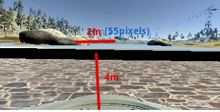


## Data Preprocessig

### 1. data balance

There are 8037 captured driving data.  Each drivng datum has center view, left view, right view, steering angle, throttle, and speed.   However, a lot of driving data are adjust driving forword with steering angle equal to zero.  It is not good for training because of data set bias.  To solve it, we calculate the histgram of the steering angle first; the we cut the number of the largest bins to the same number of the second largest bins.   The results show as follows:

<table border="1">
<tr>
<td>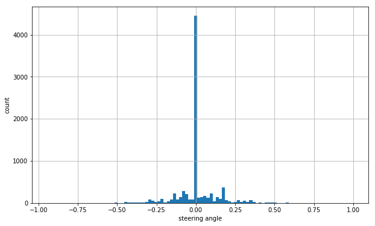</td>
<td>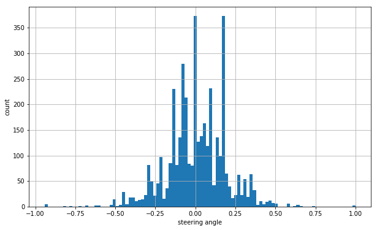</td>
</tr>
<tr>
<td><center>before data balance</center></td>
<td><center>after data balance</center></td>
</tr>
</table>

### 2. view image cropping and resizing

The size of the captured view image is 320 by 160.  The part above y=60 is infinity which we are not interested.  Even the part between y=60 and y=70 is quite far way distance which may not help a lot in training.  So we crop the image by the left-top point (0, 70) to right-bottom point (320, 136).  Then we resize it to 200 by 66 because the neural network input of nVidia architecture is 200 by 66 too.

The following shows the cropped results.

<table border="1">
<tr>
<td>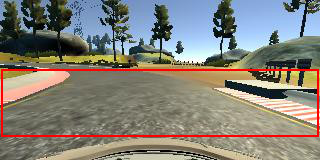</td>
<td>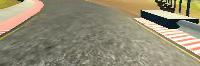</td>
</tr>
<tr>
<td><center>cropped region</center></td>
<td><center>after cropped and resized</center></td>
</tr>
</table>

## Data Augmentation

The following data augmentation are applied to increase training set and avoid overfitting.

## 1. brightness adjustment

We convert the RGB image into HSV and adjust V value randomly and convert back to RGB domain.  The following show the results.

<table border="1">
<tr>
<td></td>
<td>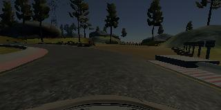</td>
</tr>
<tr>
<td><center>original</center></td>
<td><center>brightness augmentation</center></td>
</tr>
</table>

## 2. fake shadow

Add adjust part of brightness to create fake shadow for training.  The following show the results.

<table border="1">
<tr>
<td></td>
<td>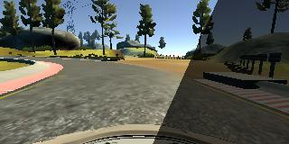</td>
</tr>
<tr>
<td><center>original</center></td>
<td><center>shadow augmentation</center></td>
</tr>
</table>

## 2. mirror augment

Just mirror the captured image and inveres the steering angle.  The following show the results.

<table border="1">
<tr>
<td></td>
<td>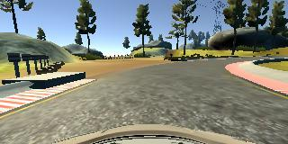</td>
</tr>
<tr>
<td><center>original</center></td>
<td><center>mirror augmentation</center></td>
</tr>
</table>

## 3. left and right camera view augment

Car driving simulator records center, left and right images at the same time.  We can applied left and right captured image to train model.   It is intuitive to steer right if the car is too left and steer left if the car is too right. But we don't have proper steering angle for then.  Proper steering angle may depends on the car speed and how quick to make the car to drive back to the center line.   

To estimate the steering angle adjustment for the left and right view, we adopt the camera shift and camera rotation formula.   We knew the camera shift 0.9M in left and right view.  Then we apply camera rotation to let their pixel shifts are rought eqaul in the middle region of the scene.  Then we estimate the steering angle is about 5 degree adjustment for the left and right side view. This value is not far away from our driving experience.  In our steering angle parameter, the maximun is 1, which is corresponding to 25 degree.  So we got steering adjustmnet value 0.2 for the left and right view image.   They are shown in the following.

<table border="1">
<tr>
<td></td>
<td></td>
<td></td>
</tr>
<tr>
<td><center>center view</center></td>
<td><center>left view, steering angle is adjusted by 0.2</center></td>
<td><center>right view, steering angle is adjusted by -0.2</center></td>
</tr>
</table>

## 4. camera shift augmentation

Besides using the left and right camera image, we can apply camera shift formula to create augmentation image.  After apply camera shift transformation, we adjust steering angle correspondingly.  The following show an example.

<table border="1">
<tr>
<td></td>
<td>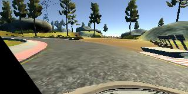</td>
</tr>
<tr>
<td><center>center view</center></td>
<td><center>camera shift left 1 meter, and <br>steering angle is adjusted by 0.22</center></td>
</tr>
</table>

## 5. camera rotation augmentation

Based on the camera transformation discussed in the previous section, we can generate camera rotation augmentation by translating the capture image horizontally.   After apply camera shift transformation, we adjust steering angle correspondingly.  In order not to over-turning, we adjust steering with half of the turning angle.  The following show an example.

<table border="1">
<tr>
<td></td>
<td>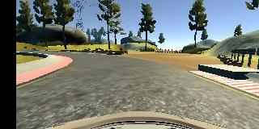</td>
</tr>
<tr>
<td><center>center view</center></td>
<td><center>camera turns left by 10 degree, and <br>steering angle is adjusted by 0.2</center></td>
</tr>
</table>


### Model Architecture and Training Strategy

#### 1. The nVidia model architecture has been employed

The nVidia model architecture is adopted.  The following shows the network, including a input layer, 5 convolutional layers, and 3 fully connected layers.  The RELU activation function is used in all layers except the last layer use sigmoid.  No dropout layers are used.   We used Tensorflow and Keras framework to implement this model.


(Sources: [Nvidia, MitTechReview, Nvidia Blog](https://devblogs.nvidia.com/deep-learning-self-driving-cars/))

#### 2. Methods to reduce overfitting in the model

The model didn't use dropout layers in order to reduce overfitting. Instead, we used a lot of data augmentation to avoid overfitting.

#### 3. Model parameter tuning

The model used an adam optimizer and mse loss function.  The learning rate was not tuned manually.

#### 4. Appropriate training data

There are about eight thousands pieces of driving data, including center image, left image, right image, steering, throttle, brake, and speed values.   

In this project, our model only trained steering value accoring the input image.  Throttle value is automatically adjust by a PID controller.  Brake and speed value is not used in the training processs.  

A lot of data is driving forward with steering = 0, which will cause training bias.  We did 
data balance by cutting the number of them.  After data balance, there are about four thousands data set. The 25% of the data are split as our validation data.  Only the center image is used for our validation.  The left and right can be used as data augmention but not proper for data validation. 

The rest 75% of the data are used for training.   Besides the center image, the left and right image are used in training as discussed in the previous data augmentation section. Data augmentation methods, such as brightness, shadow, mirror, cam shift, and cam rotation, are applied to the center, left, right images randomly.  We used Keras fit_generator function to generate these augmetation data dynamically.

#### 5. Throttle and brake strategy

We didn't train the throttle value. Instead, we used a PID controller to controll throttle value given a speed.  The speed may varies during running.  When the car is running straight, say steering angle is 0 or small, we would like run fast.  On the other side, when the can is turning,say steering angle is large, we would like run slow.  We dynamic adjust speed from the maximum speed 12 MPH to the minimum speed 6 MPH.

The car turns on brake when throttle is negative.   However, we would not like to brake the car too often.  We did a littfle adjustment, when the throttle is a little below 0, say betwteen 0 and -0.4, just let throttle be 0.   When the throttle is below -0.4, the brake turn on by letting throttle be (throttle+0.4)

### Training processing and results

### 1. training for track1

It is not difficult to make car run full rounds of the first track after a few epoches training.  The following shows the result video.  Click the image for viewing the [full video](https://youtu.be/EqeabxImtz0).

[](https://youtu.be/EqeabxImtz0)  

### 2. training for track2

Track2 is much challedge for self-drivig.  There are a lot of shadows, quick turns, uphills and downhills.  Even we did data augment of track1 driving data in training, we still failed track2 on the first quick U-turn.   I thought more training driving data for track2 are needed.  However, I never thought I was a good game car driver and I had enough patient and skills to drive well through the full round of the track2 by keyboard control.  

I used another approach to collect driving data.  We had a trained model for self-driving and could drive car on track2. So we could collect driving data of the track2 before it crashed. We just removed the incorrect or crashed frames of the collected data and added them into our training set.  Then, we trained the model again.  After trained, we used the new trained model to run the track2 again.  The car might (or might not) run a little farther than last time.  If it was, we could collect more driving data for training.   We repeated the following training cycle until the car learning the whole round trip.  

1. run the trained model on track2 and collect the captured frames and steering angles
2. remove or modify incorrect or crashed frames
3. add the collected driving data into our training set
4. train the model again
5. goto step 1 to run the trained model on track2 again

The following shows the result video.  Click the image for viewing the [full video](https://youtu.be/GzPWI4F-pe0).

[](https://youtu.be/GzPWI4F-pe0)  


### Discussions

### 1. car stuck bug in the car simulator

When I run the trained model on the track2, the car got stuck when its speed slow down sometimes.  The following show an example of car stuck.  It was on the downhill, steering angle was around 0 and throttle was above 15 and keeping raising because of PID controller.   I had no idea how it happened and how to resolve.  All I just did was quit and run the model and the simulator again.  

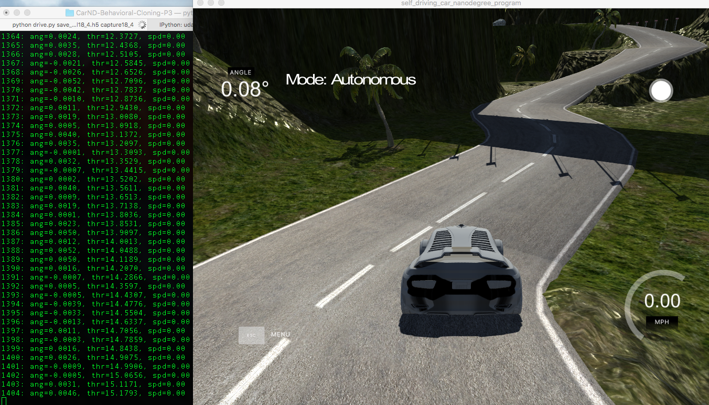

### 2. keeping car in the right lane

There are two lanes in the track2.  The car should keep in the right lane by our driving experience.  However, our self-driving model doesn't attend to keep the car in the right lane.  There are two reasons.  First, we started our training data from track1, which only has one lane.  The model could not learn two or multiple lanes knowledge from it.   The other, even after including the track2 trained data, we did mirror data augmentation, which also reversed the left and the right lane sides.  Therefore, it is impractice to let the car to keep in right lane. 

###  3. car swinging on the road

Because of data bias balance, we cut most of car driving data with zero or very small steering angle.  It caused the model to drive the car in a swinging way.  We had tried to train the model more epoches, it could reduce swings a little in the track one.  However, the new model apted to be crashed easier in the track two. It may be because the model is more overfitted for track1 and cannot repsonse the quick turn road in track two.  

After we added the track two data to train, the self-driving car became in a more swinging way in the track one but still can run full round without problem.      The result videos in the previous session came from the same model after trained both track one and track two data.  I thought it would be an open issue how to self-driving safely and smoothly without too much unnecessary swings. 

###  4. data qualities in the collected data for track two

We used the old trained model to run and collect the driving data of the track two.   The car may stay in the road but not drive elegantly in some cases.   We still add them to our training set.  That is, the model may learning an ugly way to keep the car staying in the road.  We believed the model would learn better if we gave more elegant driving data.   However, the model still learned how to drive the car on the road without crashed. 


###  5. car response lag in recording videos

The trained model coould drive full rounds both in the track one and track two.  However, when I started to record the video in my MacBook Air, the car was much easier to went outside track in the quick turns.  This is because the car simulator was realtime and our model took CPU to run the deep learning model and responding the correct steering angle.   When starting video recoding, it shared some CPU resource to record video and cause a very short time response lag.  These little lags might caused the car to turn too late in some quick turns of the track two.    After serveral trials, I sucessed to record a full round run of the track two.   I thought the model could drive the car more smoothly and safely when using a more powerful calculating machine.


###  6. custom maps and car self-drivng championship

This project is one of the most interestinig projects I have had.  However, only two track maps are not enough for me.  I think if it is possible to open a map editor for the car simulator.  If we have this map editor, a lot of interesting track map will be created in open source communities.   Then we may have more fun on them.   

Besides, I think Udacity can hold a car self-drivng championship for all nanodegree students.  The whole new track map may be similar to track two but different.   Every one can summit a model to compete.  Then winner of the champoinship is to see who can run the full round safely and fastest.
  

