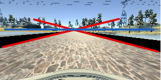

# Behaviorial Cloning Project

[](http://www.udacity.com/drive)

Overview
---
This repository contains project files for the Behavioral Cloning Project.

This project used deep neural networks and convolutional neural networks to clone driving behavior. The model will output a steering angle to an autonomous vehicle.  The neural network architecture is based on nVidia paper (https://arxiv.org/abs/1604.07316) which train a CNN to map raw pixels from a single front-facing camera directly to steering commands.  It has proven to be successful in car self-driving enviroment so it should be proper in this project. 

We use Udacity car simulator to collect view image data of the center, left and right camera, while it also records the steering angle, throttle, and speed of the driving car at the same time.   We also did data balance and image augment to increase training data quality and quantity.  After trained, the model can drive the car automatically to run on the road.


## Project Goals
* Use the simulator to collect data of good driving behavior
* Preprocess and augment collected data
* Build, a convolution neural network in Keras that predicts steering angles from images
* Train and validate the model with a training and validation set
* Test that the model successfully drives around track one without leaving the road
* Summarize the results with a written report

## File Included
* model.py: containing the script to create and train the model
* drive.py: for driving the car in autonomous mode
* model.h5: containing a trained convolution neural network 
* README.md: summarizing the results
* enviroment.yml and enviroment-gpu.yml: enviroment build script
* drive1.mp4: the video of the first track run
* drive2.mp4: the video of the second track run

## Code Excution
### 1. enviroment
I trained model on Ubuntu 14/GTX 1080 and run car simulator on Mac OSX.  To make sure these two platforms have same software version and binary compatible, I used enviroment.yml and enviroment-gpu.yml to create my training and running environment by executing
```sh
$ conda env create -f enviroment.yml 
```
or 

```sh
$ conda env create -f enviroment-gpu.yml 
```

### 2. training the model
I used Keras to build deep neural networks.  To train the model, please place collected data under ./data/ directory and ./data/driving_log.csv should exist.  Then train the model by executing
```sh
$ python model.py
```

### 3. car self-driving automatically
Using the Udacity provided simulator and my drive.py file, the car can be driven autonomously around the track by executing 
```sh
$ python drive.py model.h5
```

## Camera View and Perspective Model

### 1. perspective view parameter assumption and transformation
Car simulator will record three camera veiws: center, left, and right views, in the training mode.  But only center view is given in autonomous driving mode.   We can extend our training sets by transforming left and right views to center view based on perspective projection calculation.  However, we don't exactly know the camera positions and projection matrix so we must do some assumptiona and use some trick to estimate these parameters and transformation formula. 

We used the bridge landscape shown in the following because this bridge edges are parallel straigt lines.  We assume the car width is average width 1.9M.  Comparing to car width, we can estimate the bridge width is about 7.6M.  We can assume the center camera is positioned at the center of the car. The left and right cameras should be on the side of the car.  Here, we asumme the left and right cameras are aparted from the center camera from 0.9M, roughlt the half width of car width.    The height of camera should be roughly the same as our eyes's height in driving. We assume the camera height is about 1.5M.  


Based on these parameters assumption, we can project the road view onto the camera screen shown in the following.   We let the y-position of the camera be zero for convenience.  So the road is on the plane at y = -1.5M.    We also let the x-position of the center camera be zero so the x-poistion of the left camera and right camera are -0.9M and 0.9M, respectively. 


Car simulator records camera views shown in the following. The cross of two red lines are vanishing point of parallel lines.  They are all vanished at the same point, say (150, 60) in the captured images, in all three views.  The scene above it (blue line) is assumed at infinity or sky which we are not interested.  The scene below the blue line is assumed on the same road plane, say y = -1.5M.  The assumption may introduce some mapping distorion but it should not affect our training a lot. 

<table border="1">
<tr>
<td></td>
<td></td>
<td></td>
</tr>
<tr>
<td><center>left view</center></td>
<td><center>center view</center></td>
<td><center>right view</center></td>
</tr>
</table>

Based on the above assumption, we can estimate the x and y coordinates of the object and camera.  However, we still not know the z coordinate (z-depth) of them.   We apply the following tricks to estimate them. As shown in the following, we mark four landmarks.  These landmarks are easy to tracked in the projected center, left and right views.  Accoring to these corresponing points and perspective projection matrix, we can get the transform formula of the car horizontal shift. 

<table border="1">
<tr>
<td align="bottom"></td>
<td align="bottom"></td>
</tr>
<tr>
<td><center>perspective view</center></td>
<td><center>center view</center></td>
</tr>
</table>

After math reduction, we get a quite simple transformation formula for mapping camera shift -0.9M, which map left camera view to center view.

```math
x_{new} = \left \{
  \begin{tabular}{cl}
  1.2 x - 30, & for y > 60 \\
  don't care, &  otherwises
  \end{tabular}
```
, where x, and y are the x- and y-coordinates in the captured view image, which range from (0, 0) to (300, 160).

Similarly, the formula for mapping camera shift 0.9M, which map right camera view to center view.

```math
x_{new} = \left \{
  \begin{tabular}{cl}
  (x + 30) / 1.2, & for y > 60 \\
  don't care, &  otherwises
  \end{tabular}
```


## Data Preprocessig and Augmenting

### 1. data balance


### Model Architecture and Training Strategy

#### 1. An appropriate model architecture has been employed

My model consists of a convolution neural network with 3x3 filter sizes and depths between 32 and 128 (model.py lines 18-24) 

The model includes RELU layers to introduce nonlinearity (code line 20), and the data is normalized in the model using a Keras lambda layer (code line 18). 

#### 2. Attempts to reduce overfitting in the model

The model contains dropout layers in order to reduce overfitting (model.py lines 21). 

The model was trained and validated on different data sets to ensure that the model was not overfitting (code line 10-16). The model was tested by running it through the simulator and ensuring that the vehicle could stay on the track.

#### 3. Model parameter tuning

The model used an adam optimizer, so the learning rate was not tuned manually (model.py line 25).

#### 4. Appropriate training data

Training data was chosen to keep the vehicle driving on the road. I used a combination of center lane driving, recovering from the left and right sides of the road ... 

For details about how I created the training data, see the next section. 

### Model Architecture and Training Strategy

#### 1. Solution Design Approach

The overall strategy for deriving a model architecture was to ...

My first step was to use a convolution neural network model similar to the ... I thought this model might be appropriate because ...

In order to gauge how well the model was working, I split my image and steering angle data into a training and validation set. I found that my first model had a low mean squared error on the training set but a high mean squared error on the validation set. This implied that the model was overfitting. 

To combat the overfitting, I modified the model so that ...

Then I ... 

The final step was to run the simulator to see how well the car was driving around track one. There were a few spots where the vehicle fell off the track... to improve the driving behavior in these cases, I ....

At the end of the process, the vehicle is able to drive autonomously around the track without leaving the road.

#### 2. Final Model Architecture

The final model architecture (model.py lines 18-24) consisted of a convolution neural network with the following layers and layer sizes ...

Here is a visualization of the architecture (note: visualizing the architecture is optional according to the project rubric)

![alt text][image1]

#### 3. Creation of the Training Set & Training Process

To capture good driving behavior, I first recorded two laps on track one using center lane driving. Here is an example image of center lane driving:

![alt text][image2]

I then recorded the vehicle recovering from the left side and right sides of the road back to center so that the vehicle would learn to .... These images show what a recovery looks like starting from ... :

![alt text][image3]
![alt text][image4]
![alt text][image5]

Then I repeated this process on track two in order to get more data points.

To augment the data sat, I also flipped images and angles thinking that this would ... For example, here is an image that has then been flipped:

![alt text][image6]
![alt text][image7]

Etc ....

After the collection process, I had X number of data points. I then preprocessed this data by ...


I finally randomly shuffled the data set and put Y% of the data into a validation set. 

I used this training data for training the model. The validation set helped determine if the model was over or under fitting. The ideal number of epochs was Z as evidenced by ... I used an adam optimizer so that manually training the learning rate wasn't necessary.


To meet specifications, the project submit five files: 
* model.py (script used to create and train the model)
* drive.py (script to drive the car - feel free to modify this file)
* model.h5 (a trained Keras model)
* a report writeup file (either markdown or pdf)
* video.mp4 (a video recording of your vehicle driving autonomously around the track for at least one full lap)

This README file describes how to output the video in the "Details About Files In This Directory" section.

Creating a Great Writeup
---
A great writeup should include the [rubric points](https://review.udacity.com/#!/rubrics/432/view) as well as your description of how you addressed each point.  You should include a detailed description of the code used (with line-number references and code snippets where necessary), and links to other supporting documents or external references.  You should include images in your writeup to demonstrate how your code works with examples.  

All that said, please be concise!  We're not looking for you to write a book here, just a brief description of how you passed each rubric point, and references to the relevant code :). 

You're not required to use markdown for your writeup.  If you use another method please just submit a pdf of your writeup.

The Project
---
The goals / steps of this project are the following:
* Use the simulator to collect data of good driving behavior 
* Design, train and validate a model that predicts a steering angle from image data
* Use the model to drive the vehicle autonomously around the first track in the simulator. The vehicle should remain on the road for an entire loop around the track.
* Summarize the results with a written report

### Dependencies
This lab requires:

* [CarND Term1 Starter Kit](https://github.com/udacity/CarND-Term1-Starter-Kit)

The lab enviroment can be created with CarND Term1 Starter Kit. Click [here](https://github.com/udacity/CarND-Term1-Starter-Kit/blob/master/README.md) for the details.

The following resources can be found in this github repository:
* drive.py
* video.py
* writeup_template.md

The simulator can be downloaded from the classroom. In the classroom, we have also provided sample data that you can optionally use to help train your model.

## Details About Files In This Directory

### `drive.py`

Usage of `drive.py` requires you have saved the trained model as an h5 file, i.e. `model.h5`. See the [Keras documentation](https://keras.io/getting-started/faq/#how-can-i-save-a-keras-model) for how to create this file using the following command:
```sh
model.save(filepath)
```

Once the model has been saved, it can be used with drive.py using this command:

```sh
python drive.py model.h5
```

The above command will load the trained model and use the model to make predictions on individual images in real-time and send the predicted angle back to the server via a websocket connection.

Note: There is known local system's setting issue with replacing "," with "." when using drive.py. When this happens it can make predicted steering values clipped to max/min values. If this occurs, a known fix for this is to add "export LANG=en_US.utf8" to the bashrc file.

#### Saving a video of the autonomous agent

```sh
python drive.py model.h5 run1
```

The fourth argument, `run1`, is the directory in which to save the images seen by the agent. If the directory already exists, it'll be overwritten.

```sh
ls run1

[2017-01-09 16:10:23 EST]  12KiB 2017_01_09_21_10_23_424.jpg
[2017-01-09 16:10:23 EST]  12KiB 2017_01_09_21_10_23_451.jpg
[2017-01-09 16:10:23 EST]  12KiB 2017_01_09_21_10_23_477.jpg
[2017-01-09 16:10:23 EST]  12KiB 2017_01_09_21_10_23_528.jpg
[2017-01-09 16:10:23 EST]  12KiB 2017_01_09_21_10_23_573.jpg
[2017-01-09 16:10:23 EST]  12KiB 2017_01_09_21_10_23_618.jpg
[2017-01-09 16:10:23 EST]  12KiB 2017_01_09_21_10_23_697.jpg
[2017-01-09 16:10:23 EST]  12KiB 2017_01_09_21_10_23_723.jpg
[2017-01-09 16:10:23 EST]  12KiB 2017_01_09_21_10_23_749.jpg
[2017-01-09 16:10:23 EST]  12KiB 2017_01_09_21_10_23_817.jpg
...
```

The image file name is a timestamp of when the image was seen. This information is used by `video.py` to create a chronological video of the agent driving.

### `video.py`

```sh
python video.py run1
```

Creates a video based on images found in the `run1` directory. The name of the video will be the name of the directory followed by `'.mp4'`, so, in this case the video will be `run1.mp4`.

Optionally, one can specify the FPS (frames per second) of the video:

```sh
python video.py run1 --fps 48
```

Will run the video at 48 FPS. The default FPS is 60.

#### Why create a video

1. It's been noted the simulator might perform differently based on the hardware. So if your model drives succesfully on your machine it might not on another machine (your reviewer). Saving a video is a solid backup in case this happens.
2. You could slightly alter the code in `drive.py` and/or `video.py` to create a video of what your model sees after the image is processed (may be helpful for debugging).

### Tips
- Please keep in mind that training images are loaded in BGR colorspace using cv2 while drive.py load images in RGB to predict the steering angles.

## How to write a README
A well written README file can enhance your project and portfolio.  Develop your abilities to create professional README files by completing [this free course](https://www.udacity.com/course/writing-readmes--ud777).

