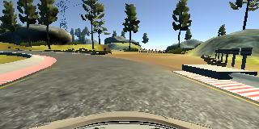

# Behaviorial Cloning Project

[](http://www.udacity.com/drive)

Overview
---
This repository contains project files for the [Behavioral Cloning Project](https://github.com/udacity/CarND-Behavioral-Cloning-P3).

This project used deep neural networks and convolutional neural networks to clone driving behavior. The model will output the steering angles to drive an autonomous vehicle.  The neural network architecture is based on [nVidia paper](https://arxiv.org/abs/1604.07316) which uses a CNN to map raw pixels from a single front-facing camera to steering commands.  This architecture has proven to be successful in car self-driving enviroment so it should be proper in this project. 

We use Udacity car simulator to collect view image data of the center, left and right cameras with the steering angle, throttle, and speed at the same time.   Data balance and augmentation are used to increase data quality of training.  After trained, the model can drive the autonomous car full rounds on both the track one and two.


## Project Goals
* Use the simulator to collect data of good driving behavior
* Preprocess and augment on the collected data
* Build a convolution neural network in Keras that predicts steering angles from images
* Train and validate the model with a training and validation set
* Test that the model successfully drives around track one without leaving the road
* Summarize the results with a written report

## File Included
* model.py: containing the script to create and train the model
* drive.py: for driving the car in autonomous mode
* model.h5: containing a trained convolution neural network 
* README.md: summarizing the results
* enviroment.yml and enviroment-gpu.yml: enviroment build script

## Code Excution
### 1. enviroment
The model was trained on Ubuntu 14/GTX 1080 and driving car by the simulator on Mac OSX.  These two platforms have same software version, binary compatible by the conda enviroment.yml and enviroment-gpu.yml scripts.  The environment is created by executing
```sh
$ conda env create -f enviroment.yml 
```
or 

```sh
$ conda env create -f enviroment-gpu.yml 
```

### 2. training the model
Tensorflow and Keras platforms are used to build deep neural networks.  The training data are needed to be download manually or be collected by the car simulator.  The collected driving data are put under ./data/ directory and ./data/driving_log.csv should exist.  The model is started to train by executing
```sh
$ python model.py
```

### 3. drive a autonomous car by the model
The car can be driven autonomously around the track in the car simulator by executing 
```sh
$ python drive.py model.h5
```

## Computer Graphics Model for Camera View

### 1. assumptions for perspective view parameters 
The car simulators record three camera veiws: center, left, and right views, in the training mode.  Only the center view is given in autonomous driving mode.   We can extend our training sets by transforming left and right views to center view based on perspective projection modification.  But we don't have the exact camera positions and projection matrix of them.  We made some assumptions and adopted some tricks to estimate these parameters and projection formula. 

The bridge landscape shown in the following were used because they are parallel straigt lines in the scene.  Th car width is assumed as the average width 1.9 meters.  Comparing to the car width, the bridge width is estimated about 7.6 meters.  The center camera is assumed to position at the center of the car. The left and right cameras are on the side of the car and assumed to be aparted from the center camera from 0.9 meters.    The height of camera is roughly the same as our eyes's height in driving, about 1.5 meter.  


Based on these assumption, the road views are projected onto the camera screen illustrated in the following.   The y-positions of the camera are set to be zero for convenience.  Therefore, the road is on the plane at y = -1.5 meter.    The x-position of the center camera is set to be zero, and the x-poistions of the left camera and right camera are -0.9 meter and 0.9 meter, respectively. 


The center, left and right camera views recorded by the car simulator are shown in the following. The cross of two red lines are the vanishing point of parallel lines.  They are all vanished at the same point, say (160, 60) in all our captured images.  The scene above the blue line is infinity or sky which we are not interested for car driving.  The scene below the blue line is the road and assumed at the same plane, say y = -1.5 meter.  The assumption may introduce some distorion but it works in most cases. 

<table border="1">
<tr>
<td></td>
<td></td>
<td></td>
</tr>
<tr>
<td><center>left view</center></td>
<td><center>center view</center></td>
<td><center>right view</center></td>
</tr>
</table>

### 2. transformation for camera shift

Based on these assumption, we have the x and y coordinates of the object and camera.  We need furthur to estimate the z coordinate (z-depth) for projection.   The tricks of corresponding landmarks are used to estimate them.   These landmarks marked in the following images are easy to tracked in the all three views.  z-depth and the projection matrix are calculated accoring to these corresponing points. 

<table border="1">
<tr>
<td align="bottom"></td>
<td align="bottom"></td>
</tr>
<tr>
<td><center>perspective view</center></td>
<td><center>center view</center></td>
</tr>
</table>

After math reduction and some linear regression, A quite simple transformation formula for the camera shift.


, where x, and y are the x- and y-coordinates in the captured view image, which range from (0, 0) to (300, 160). Parameter &alpha; is found the linear regresssion fitting the above landmarks.  The &alpha; is found as 0.72. 

The following gives the examples to apply these formula to map the left and right camera view to the center camera position. That is, shift the left camera view by 0.9 meter and the right one by -0.9 meter.  These shifting transforms to make these images viewed similarily at the center position.   We can compare them to the real center images, and they are quite matched. 

<table border="1">
<tr>
<td></td>
<td></td>
<td></td>
</tr>
<tr>
<td><center>left view</center></td>
<td><center>center view</center></td>
<td><center>right view</center></td>
</tr>
<tr>
<td></td>
<td></td>
<td></td>
</tr>
<tr>
<td><center>mapped left view to center camera</center></td>
<td><center>original center view</center></td>
<td><center>mapped right view to center camera</center></td>
</tr>
</table>

### 3. transformation for camera view rotation

The image moves left if the camera direction turns right.   The translation of the images are used for data augmentation for a small camera view angle rotation horizontally.
 The corresponding relationship between the image translation and the camera rotation angle are estimated by using the below image. The width 2 meters is got by comparing with car width.  The depth 4m is got by the bridge width substracting the car trunk size.  The relationship that translating 1 pixel is roughly to rotate 0.5 degress angle is got.


## Data Preprocessig

### 1. data balance

There are 8037 captured driving data.  Each piece of drivng data has center view, left view, right view, steering angle, throttle, brake and speed.   The data is unbalanced because most of them are adjust driving forword with very small steering angles. To balance the data, we calculate the histgram of the steering angle first; then we cut the number of the largest bins to the same number of the second largest bins.  About 4000 driving set with very small steering angles are dropped out.  The histogram of the balance data set is shown below.

<table border="1">
<tr>
<td></td>
<td></td>
</tr>
<tr>
<td><center>before data balance</center></td>
<td><center>after data balance</center></td>
</tr>
</table>

### 2. view image cropping and resizing

The size of the captured view image is 320 by 160.  The part above y=60 is infinity which are not very useful for car driving.  Even the part between y=60 and y=70 is located at quite far way distance which may not help a lot in training.  So we crop the image by the left-top point (0, 70) to right-bottom point (320, 136).  Then we resize it to 200 by 66 because the neural network input of nVidia architecture is 200 by 66 too.

The following shows the cropped results.

<table border="1">
<tr>
<td></td>
<td></td>
</tr>
<tr>
<td><center>cropped region</center></td>
<td><center>after cropped and resized</center></td>
</tr>
</table>

## Data Augmentation

The following data augmentation methods are applied to increase training set quality and quantity. They also avoid overfitting in training model.

## 1. brightness adjustment

The RGB images are converted into HSV and adjust V value randomly.  Then they are converted back to RGB domain. An example is shown below.
 
<table border="1">
<tr>
<td></td>
<td></td>
</tr>
<tr>
<td><center>original</center></td>
<td><center>brightness augmentation</center></td>
</tr>
</table>

## 2. fake shadow

Modify part of brightness to generate fake shadow.  An example is shown below.

<table border="1">
<tr>
<td></td>
<td></td>
</tr>
<tr>
<td><center>original</center></td>
<td><center>shadow augmentation</center></td>
</tr>
</table>

## 2. mirror augment

Mirror the image and inveres the steering angle at the same time.  An example is shown below.

<table border="1">
<tr>
<td></td>
<td></td>
</tr>
<tr>
<td><center>original</center></td>
<td><center>mirror augmentation</center></td>
</tr>
</table>

## 3. left and right camera view augmentation

The images of the left and the right cameras are used in data augmentation.  It is intuitive to steer right if the car is too left and steer left if the car is too right. But the proper steering angle may depends on the car speed and how quick to make the car to drive back to the center line.   

To estimate the steering angle adjustment for the left and right view, we adopt the camera shift and camera rotation formula.   We knew the camera shift 0.9 meter in left and right view assumed in the previous session.  The camera rotation of the capture image was also applied to let their pixel shifts are roughly eqaul in the middle region of the scene.  Based on this trick, the steering angle is estimated about 5 degree adjustment for the left and right side view. This value is not far away from our driving experience.  The maximun of the steering angle parameter in the car simulator is 1, which is corresponding to 25 degree.  So we got steering adjustmnet value 0.2 for the left and right view image.   They are shown in the following.

<table border="1">
<tr>
<td></td>
<td></td>
<td></td>
</tr>
<tr>
<td><center>center view</center></td>
<td><center>left view, steering angle is adjusted by 0.2</center></td>
<td><center>right view, steering angle is adjusted by -0.2</center></td>
</tr>
</table>

## 4. camera shift augmentation

Besides using the real left and right camera image, we can apply camera shift formula discussed in the previous session to generate augmentation image.  The steering angles are adjusted correspondingly when generating augmentation image with camera shifting.  An example is shown below.

<table border="1">
<tr>
<td></td>
<td></td>
</tr>
<tr>
<td><center>center view</center></td>
<td><center>camera shift left 1 meter, and <br>steering angle is adjusted by 0.22</center></td>
</tr>
</table>

## 5. camera rotation augmentation

The data augmentation with camera rotation horizontally are also generated based on the the camera transformation discussed in the previous section.   The steering angles are adjusted correspondingly when generating them.  In order not to over-steering, we only adjust steering angle with half of the camera rotation angle.  An example is shown below.

<table border="1">
<tr>
<td></td>
<td></td>
</tr>
<tr>
<td><center>center view</center></td>
<td><center>car camera rotates left horizontally by 10 degree, and <br>steering angle is adjusted by 0.2</center></td>
</tr>
</table>


### Model Architecture and Training Strategy

#### 1. The nVidia model architecture has been employed

The nVidia model architecture is adopted, including a input layer, 5 convolutional layers, and 3 fully connected layers.  The RELU activation functions are used in all layers except the last layer uses sigmoid.  No dropout layers are used.   We used Tensorflow and Keras framework to implement this model.


(Sources: [Nvidia, MitTechReview, Nvidia Blog](https://devblogs.nvidia.com/deep-learning-self-driving-cars/))

#### 2. Methods to reduce overfitting in the model

No dropout layers are used in the model. Instead, we applied a lot of data augmentation to avoid overfitting.

#### 3. Model parameter tuning

The model used an adam optimizer and mse loss function.  The learning rate was not tuned manually.  Most of training hyperparameters used default values.

#### 4. Appropriate training data

There are about eight thousands pieces of driving data, including center image, left image, right image, steering, throttle, brake, and speed values.   Only steering value was trained by giving the input images. Throttle value was automatically controlled by a PID controller.  Brake and speed value was not used in the training processs.  

The original driving data were unbalanced because of a lot of data have very small steering angle. We did 
data balance by the method described in the previous session.  After data balance, the one fourth of the data are split as our validation data.  Only the center images of them are used for validation. 

The rest three fourths of the data are used for training.   Besides the center image, the left and right image are also used in training as discussed in the data augmentation section. Data augmentation methods, such as brightness, shadow, mirror, cam shift, and cam rotation, are applied to the center, left, right images randomly.  We used Keras fit_generator function to generate these augmetation data dynamically.

#### 5. Throttle and brake strategy

Throttle value was not trained directly. A PID controller was applied to controll throttle value at a given speed.  The speed may varies during running.  When the car was running straight, say steering angle was 0 or very small, we would like run faster.  On the other side, when the car was turning, say steering angle was large, we would like run slower.  We dynamic adjusted speed from the maximum speed 12 MPH to the minimum speed 6 MPH according to steering angle.

The car started to brake when throttle is negative.   However, we would not like to brake the car too often.  When the throttle was a little below 0, say betwteen 0 and -0.4, we just let throttle be 0.   Only when the throttle is below -0.4, we started to brake by letting the throttle value be (throttle+0.4).

### Training processing and results

### 1. training for track one

It did not have much difficulty to make car run the full round of the first track after a few epoches training.  The following shows the result video.  Click the image for viewing the [full video](https://youtu.be/EqeabxImtz0).

[](https://youtu.be/EqeabxImtz0)  

### 2. training for track two

Track two is much challedge for autonomous self-drivig.  There are a lot of shadows, quick turns, uphills and downhills.  Even we did much data augment of the track one driving data in training, we still failed track two on the first quick U-turn.   I thought more training driving data for track two were needed.  However, I didn't thought I was a good game car driver and I had enough patient or skills to drive well through the full round of the track two by keyboard control.  
I used another approach to collect driving data for the track two.  We had a workable model based on the track one data.  Then this model can be used to drive the car on the track two.  Some driving could be collected before it crashed. We just removed or modified the incorrect or crashed frames of the data and added them into our training set.  Then, we trained the model again.  After trained, the new trained model were used to run the track two again.  The car might (or might not) run a little farther than last time.  If it was, we could collect more driving data for next training.   We repeated this training cycle until the car learning the whole round trip as describled in the following.  

1. run the trained model on track two and collect the captured frames and steering angles
2. remove or modify the incorrect or crashed frames
3. add the collected driving data into our training set
4. train the model again
5. goto step 1 to run the trained model on track2 again

The following shows the result video.  Click the image for viewing the [full video](https://youtu.be/GzPWI4F-pe0).

[](https://youtu.be/GzPWI4F-pe0)  


### Discussions

### 1. car stuck bug in the car simulator

When I run the trained model on the track two, the car got stuck sometimes when its speed slowed down.  An example of car stuck is captured as the below image.  This example happened on the downhill, steering angle was around 0 and throttle was above 15 and keeping raising because of PID controller.  Others might happen in different conditions.  I had no idea how it happened and how to resolve.  All I did was just quit and run the model and the simulator again.  


### 2. keeping car in the right lane

There are two lanes in the track two.  The car should keep in the right lane by our driving experience.  However, our self-driving model doesn't attend to keep the car in the right lane.  There are two reasons.  First, we started our training data from track one, which only has one lane.  The model could not learn two or multiple lanes knowledge from it.   The other, even after including the track two trained data, we did mirror data augmentation, which also reversed the left and the right lane sides.  Therefore, it is much difficult to let the car to keep in right lane.   Our model might drive the car in both two lanes in the track two.

###  3. car swinging on the road

Because of data balance processing, we cut most of car driving data with zero or very small steering angle.  It might caused the model to drive the car in a swinging way because the car apted to turn even in the straight road.  We tried to train the model with much more epoches, it could reduce swings a little in the track one.  However, the new trained model apted to be crashed much easier in the track two than the original one. It may be because the model was more overfitted for track one and cannot response the quick turn road in track two.  

After we added the track two data to train, the car can run safely on the track two.  However, the self-driving car became more swinging run in the track one.  But the trained model can run full round of both track one and two without problems.   The result videos shown above came from the same trained model of both track one and track two data.  I thought it would be an open issue how to self-driving safely but smoothly without too much unnecessary swings. 

###  4. data qualities in the collected data for track two

We used the model based on the track one to run and collect the driving data of the track two.   The car may stay in the road but not drive elegantly in some cases.   These data are still to be added into our training set.  That is, the model may learning an ugly way to keep the car staying in the road.  We believed the model would learn better if we gave more elegant driving data.   However, the model still learned how to drive the car on the road without crashed successfully. 


###  5. car response lag in recording videos

The trained model could drive full rounds both in the track one and track two.  However, when I started to record the video in my MacBook Air, the car was much easier to went outside track in the quick turns.  This is because the car simulator controller was realtime. Our model took CPU to run the deep learning network and responding the correct steering angle in time.   When starting video recoding, it shared some CPU resources to record video and cause a very short response lag.  These little lags might caused the car to turn too a little late in some cases of the track two.    After serveral recording trials, I sucessed to record a full round run of the track two (only once the car run out of track and came back).   I thought the model could drive the car more smoothly, quickly and safely when using a more powerful calculating machine.


###  6. custom maps and car self-drivng championship

This project is one of the most interestinig projects I have had.  However, only two track maps are not enough for us.  I think if it is possible to open a map editor for the car simulator.  If the map editor is open, I believe a lot of interesting track map will be created.   We may have much more fun on them.   

Besides, I think Udacity can hold a car self-drivng championship for all nanodegree students.  A whole new track map is created for it.   Every one can summit a model to compete.  Then winner of the champoinship is to see who can run the full round safely and fastest.
  

